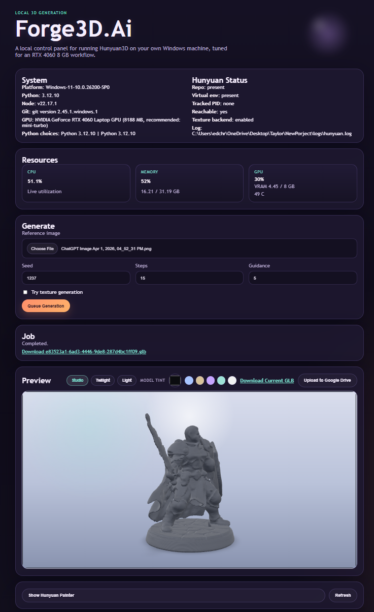

# Forge3D.Ai

<p align="center">
  
</p>

<p align="center">
  Local Windows launcher for Hunyuan3D with preview, history, queue management, packaging, and zero per-credit fees.
</p>

<p align="center">
  
  
  
  
</p>

Forge3D.Ai is a local control panel for running `Hunyuan3D-2` on your own Windows machine. It wraps the upstream Hunyuan API with a custom UI for image-to-3D generation, previewing, comparing, queuing, and packaging into a shareable Windows app.

## Gallery




## Why This Exists

Most hosted 3D generators charge per generation. Forge3D.Ai is built for running the pipeline locally instead:

- your own GPU
- your own model downloads
- your own launcher UI
- no recurring generation credit costs

## Features

- Local launcher for `Hunyuan3D-2` on Windows
- Start/stop controls for the upstream Hunyuan API
- Image-to-3D job queue with active, pending, and recent states
- In-browser `GLB` preview
- History gallery with rerun, notes, compare, and downloads
- Workspace folders per run with source image, notes, and exported model
- Resource viewer for CPU, RAM, GPU, VRAM, and temperature
- Theme switching in the UI
- Windows packaging with `PyInstaller` and `Inno Setup`

## Recommended Hardware

Recommended starting point for this project:

- `RTX 4060 8 GB` or better for `Hunyuan3D-2mini`
- `32 GB RAM` is comfortable
- NVIDIA GPU required for the intended workflow

Practical guidance:

- shape generation: good fit for `8 GB VRAM`
- texture generation: possible, but much more memory-sensitive
- safest model for lower-VRAM cards: `Hunyuan3D-2mini`

## Project Layout

- `app.py`: FastAPI backend, queue orchestration, local launcher API
- `static/`: launcher UI
- `scripts/setup_hunyuan.ps1`: clone/bootstrap upstream Hunyuan repo and environment
- `scripts/build_windows_release.ps1`: build portable app and installer
- `packaging/Forge3DAi.iss`: Inno Setup installer definition
- `assets/`: icon and branding assets

## Quick Start

1. Install launcher dependencies:

```powershell
python -m pip install -r requirements.txt
```

2. Bootstrap upstream Hunyuan:

```powershell
powershell -ExecutionPolicy Bypass -File .\scripts\setup_hunyuan.ps1
```

3. Start the launcher:

```powershell
python -m uvicorn app:app --host 127.0.0.1 --port 7861
```

4. Open:

```text
http://127.0.0.1:7861
```

## One-Click Launch

After upstream setup is complete:

```bat
start_hunyuan_launcher.bat
```

For first-time setup plus launch:

```bat
setup_and_start_hunyuan.bat
```

## Build a Windows App

Build the portable app folder and installer:

```powershell
powershell -ExecutionPolicy Bypass -File .\scripts\build_windows_release.ps1
```

Outputs:

- portable app: `dist\Forge3DAi\Forge3DAi.exe`
- installer: `dist\Forge3DAi-Setup.exe`

## Sharing With Other People

You can share either:

- `dist\Forge3DAi-Setup.exe`
- the full `dist\Forge3DAi\` folder

What your friends still need:

- a compatible NVIDIA GPU
- internet on first run for model downloads
- enough VRAM for the model/profile they choose

## Notes

- This project is for local/self-hosted Windows use.
- The upstream Tencent Hunyuan license is not a standard permissive OSS license. Read it before redistribution or commercial use.
- The bootstrap script installs CUDA-enabled PyTorch from the official PyTorch wheel index.
- If Python `3.11` is available, it is the safer path for ML compatibility than `3.12`.
